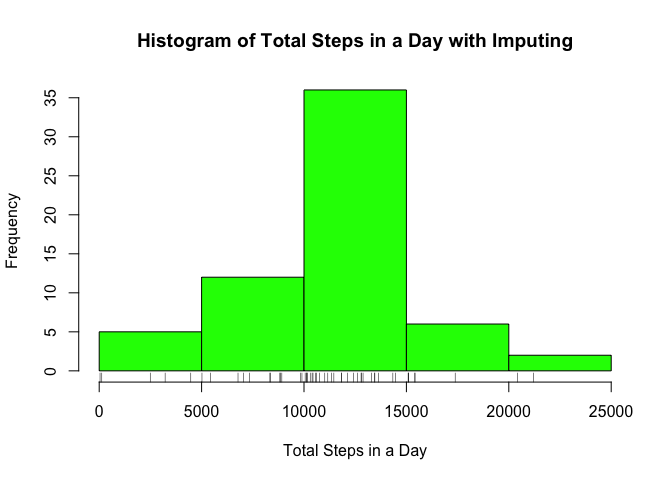

# Reproducible Research: Peer Assessment 1


## Loading and preprocessing the data

The data from the personal activity monitoring device was first loaded using the following code.


```r
activity_data<-read.csv("activity.csv")
```

Using the above code, the date is stored as a factor. The following code will preprocess the data such that the date is in the Date format.


```r
library(dplyr)
activity_data<-activity_data%>%mutate(date=as.character(date))%>%
  mutate(date=as.Date(date,"%Y-%m-%d"))
```

## What is mean total number of steps taken per day?

The following code calculates the total number of steps per day while ignoring missing values.


```r
total_Steps<-with(activity_data,aggregate(x=steps,by=list(date),FUN=sum))
```

After removing missing values, some days may no longer contain data - resulting in missing values in *total_Steps*. The following code removes these values.


```r
total_Steps<-total_Steps[complete.cases(total_Steps),]
```

With the total steps per day known, a histogram was made using the following code.


```r
hist(total_Steps$x,xlab="Total Steps in a Day",ylab="Frequency",main="Histogram of Total Steps in a Day",col="green")
rug(total_Steps$x)
```

\

With the daily total steps known, the median and mean of the total steps is calculated in the code below.


```r
mean(total_Steps$x)
```

```
## [1] 10766.19
```

```r
median(total_Steps$x)
```

```
## [1] 10765
```

## What is the average daily activity pattern?

The following code calculates the average daily activity pattern for each 5 minute interval, ignoring missing values.


```r
mean_Steps_Int<-with(activity_data,aggregate(x=steps,by=list(interval),FUN=function(x){mean(x,na.rm=TRUE)}))
```

The average activity pattern for each 5 minute interval is shown on the plot below.


```r
library(ggplot2)
ave_plot<-ggplot(mean_Steps_Int,aes(Group.1,x))+geom_line()
ave_plot<-ave_plot+labs(x="5 minute interval",y="Average number of Steps",title="Average Daily Activity Pattern")
ave_plot
```

\

The interval with the maximum average number of steps is calculated from the code below.


```r
ordered_Int<-arrange(mean_Steps_Int,desc(x))
ordered_Int[1,1]
```

```
## [1] 835
```

## Imputing missing values

The number of incomplete cases is calculated by the following code.


```r
sum(!complete.cases(activity_data))
```

```
## [1] 2304
```

The following code imputs missing values using the average activity pattern for the time interval.


```r
activity_data_Imp<-activity_data

for (i in 1:nrow(activity_data_Imp)) {
  if (is.na(activity_data_Imp[[i,"steps"]])){
    interval<-activity_data_Imp[[i,"interval"]]
    activity_data_Imp[i,"steps"]<-mean_Steps_Int[mean_Steps_Int$Group.1==interval,"x"]
  }
}

sum(!complete.cases(activity_data_Imp))
```

```
## [1] 0
```

The histogram, mean and median of total steps per day of the new data set is determined by the following code.


```r
total_Steps_Imp<-with(activity_data_Imp,aggregate(x=steps,by=list(date),FUN=sum))

hist(total_Steps_Imp$x,xlab="Total Steps in a Day",ylab="Frequency",main="Histogram of Total Steps in a Day with Imputing",col="green")
rug(total_Steps$x)
```

\

```r
mean(total_Steps_Imp$x)
```

```
## [1] 10766.19
```

```r
median(total_Steps_Imp$x)
```

```
## [1] 10766.19
```

It is seen from the histogram that the effect of imputing the values is to increase the number of days where the total steps were between 10000 and 15000. The mean of the data does not change but the median of the data changes to the mean. 

These trends are believed to stem from the fact that whole days included only missing values. When the average activity pattern was substituted in for these days, the total number of steps for the day would be the previous mean. The addition of days with the same number of steps as the mean would not change the mean and would explain the change in the histogram. As the median was originally close to the mean, the addition of multiple days with total steps equal to the mean could push the median to the mean.

## Are there differences in activity patterns between weekdays and weekends?

The following code adds a column to the data set that indicates whether the day was a weekend or weekday.


```r
activity_data<-activity_data%>%
  mutate(wday=(weekdays(date)=="Sunday")|(weekdays(date)=="Saturday"))%>%
  mutate(wday=replace(wday,wday==TRUE,"weekend"))%>%
  mutate(wday=replace(wday,wday==FALSE,"weekday"))%>%
  mutate(wday=as.factor(wday))
```

Once the above factor is added to the date, the following code calculates the average steps per time interval for weekends and weekdays.


```r
mean_Steps_week<-with(activity_data,aggregate(x=steps,by=list(interval,wday),FUN=function(x){mean(x,na.rm=TRUE)}))
```

The following code plots the average activity trends for both the weekend and weekday.


```r
library(lattice)
xyplot(x~Group.1|Group.2,data=mean_Steps_week,xlab="5 minute interval",ylab="Average Number of Steps",layout=c(1,2),type="l")
```

\


